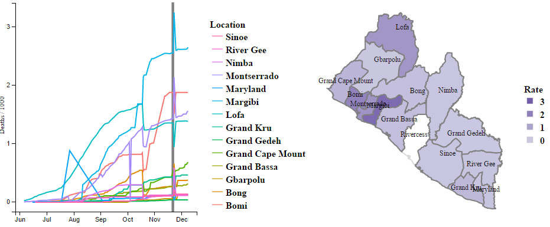

```{r setup, echo = FALSE, message=FALSE, warning=FALSE, cache=FALSE}
knitr::opts_chunk$set(echo = F, 
                      message = F, 
                      warning = F, 
                      cache = F, 
                      tidy = F, 
                      size = "footnotesize", 
                      results = "asis", 
                      comment = "#>", 
                      fig.align = "center", 
                      fig.width = 9, 
                      fig.height = 5)
options(show.signif.stars = F, 
        digits = 4)
set.seed(42)

# miscellaneous packages
library(tidyr)
library(dplyr)
library(lubridate)
library(stringr)
# loading national data
load("data/clean/lib_national_data.RData")
# loading county data
load("data/clean/lib_county_data.RData")
# loading county data
load("data/clean/lib_ebola.RData")
# loading coordinates of Liberia counties
load("data/clean/Lib-county-coords.RData")
# county centers and their names
load("data/clean/county_center.RData")
```

## At the end of June

```{r leaflet_june, results='asis'}
# first date
county_first <- county_dat %>% 
  filter(Date == ymd("2014-06-28"), 
         !is.na(Total_death_s_in_confirmed_probable_suspected_cases)) %>% 
  mutate(Rate = Total_death_s_in_confirmed_probable_suspected_cases / Population * 1000)  %>% 
  select(Location, lon, lat, order, Date, Rate) %>% 
  arrange(Location, order)
# unique locations
unique_locs1 <- unique(county_first$Location)
# fills
cols1 <- c("#f2f0f7", "#cbc9e2")
county_fills_first <- county_first %>% 
  select(Location, Rate) %>% 
  distinct() %>% 
  mutate(bins = cut(Rate, 2), 
         levs = as.numeric(bins), 
         fill = cols1[levs])

# leaflet plot
library(leaflet)
m_first <- leaflet() %>% 
  addTiles(
    'http://server.arcgisonline.com/ArcGIS/rest/services/World_Topo_Map/MapServer/tile/{z}/{y}/{x}'
  ) %>% 
  setView(-9.429499, 6.428055, zoom = 7)
for(i in 1:length(unique_locs1)) {
  m_first <- m_first %>% 
    addPolygons(
      county_first$lon[county_first$Location == unique_locs1[i]], 
      county_first$lat[county_first$Location == unique_locs1[i]], 
      color = "grey", 
      fillOpacity = 0.8, 
      fillColor = county_fills_first$fill[county_fills_first$Location == unique_locs1[[i]]]
    )
}
m_first
```

## In the beginning of December

```{r leaflet_december, results='asis'}
# last date
county_last <- county_dat %>% 
  filter(Date == ymd("2014-12-09")) %>% 
  mutate(Rate = Total_death_s_in_confirmed_probable_suspected_cases / Population * 1000)  %>% 
  select(Location, lon, lat, order, Date, Rate) %>% 
  arrange(Location, order)
# unique locations
unique_locs <- unique(county_last$Location)
# fills
cols <- c("#cbc9e2", "#9e9ac8", "#756bb1", "#54278f")
county_fills <- county_last %>% 
  select(Location, Rate) %>% 
  distinct() %>% 
  mutate(bins = cut(Rate, 4), 
         levs = as.numeric(bins), 
         fill = cols[levs])

m <- leaflet() %>% 
  addTiles(
    'http://server.arcgisonline.com/ArcGIS/rest/services/World_Topo_Map/MapServer/tile/{z}/{y}/{x}'
  ) %>% 
  setView(-9.429499, 6.428055, zoom = 7)
for(i in 1:length(unique_locs)) {
  m <- m %>% 
    addPolygons(
      county_last$lon[county_last$Location == unique_locs[i]], 
      county_last$lat[county_last$Location == unique_locs[i]], 
      color = "grey", 
      fillOpacity = 0.8, 
      fillColor = county_fills$fill[county_fills$Location == unique_locs[[i]]]
    )
}
m
```

## The Data

The raw data [available on GitHub](https://github.com/cmrivers/ebola)


## Thoughts on the Raw Data

* Data are collected at the Country and County levels
* There's a separate file for each date
* There are a lot of potential variables
* Rows and columns are backwards

## Cleaned Data

The cleaned data from the month of July

```{r clean_data_handsontable, results='asis'}
library(rhandsontable)
county_dat %>% 
  select(-lon, -lat, -id, -order) %>% 
  distinct() %>% 
  mutate(Date = ymd(Date)) %>% 
  filter(month(Date) == 7) %>% 
  arrange(Date, Location) %>% 
  rhandsontable(width = 1000, height = 450) 
```

## Examining the Variables over Time

```{r vars_over_time}
library(ggplot2)
theme_set(theme_bw())
# plot of each variable over time
p1 <- national_dat %>% 
  select(-lon, -lat, -Population) %>% 
  gather(Var, Count, -Date) %>% 
  mutate(Var = Var %>% 
           str_replace_all("Case_Fatality_Rate_", "") %>% 
           str_replace_all("Cumulative", "Cum") %>% 
           str_replace_all("probable", "prob") %>% 
           str_replace_all("suspected", "susp") %>% 
           str_replace_all("confirmed", "conf") %>% 
           str_replace_all("Probable", "prob") %>% 
           str_replace_all("Suspected", "susp") %>% 
           str_replace_all("Confirmed", "conf") %>% 
           str_replace_all("_s_", "s_") %>% 
           str_replace_all("Total_", "")
         ) %>% 
  qplot(Date, Count, data = ., geom = "line", facets = ~Var) + 
  theme(axis.text.x = element_text(angle=45), 
        strip.text = element_text(angle = 5))

library(imageR)
library(htmltools)
library(base64enc)

# make a tempfile to hold our chart  
tf <- tempfile()
# delete our tempfile on exit
on.exit(unlink(tf))

# save our chart as a big png; exaggerate the width
png( tf, height = 500, width = 800 )
  p1
d <- dev.off()

intense(
  tags$img(
    style="height:500px;"
    ,src = dataURI(file=tf,mime="image/png")
  )
  ,height = 500
)
```

## Total Cases by County

```{r county_line_plot}
lib_ebola %>% 
  filter(Location != "National") %>% 
  qplot(Date, Total_death_s_in_confirmed_probable_suspected_cases, data = ., 
        group = Location, geom = "line", colour = Location) + 
  scale_colour_discrete(guide = F) + 
  labs(y = "Total Deaths", title = "Spread of Ebola in 2014 by County") 
```

## Map of Liberia

```{r liberia-leaflet, results='asis'}
library(leaflet)
m <- leaflet() %>% 
  addTiles(
    'http://server.arcgisonline.com/ArcGIS/rest/services/World_Topo_Map/MapServer/tile/{z}/{y}/{x}'
    ) %>% 
  setView(-9.429499, 6.428055, zoom = 7)
m
```

## Adjusting for Population Size

```{r county_death_rate}
lib_ebola %>% 
  filter(Location != "National") %>% 
  mutate(rate = Total_death_s_in_confirmed_probable_suspected_cases / Population * 1000) %>% 
  qplot(Date, rate, data = ., 
        group = Location, geom = "line", colour = Location) + 
  labs(y = expression(Deaths/1000), title = "Spread of Ebola in 2014 by County") 
```

## Removing 10/28 and 11/4 Data

```{r county_death_rate2}
# setting up cleaned data set for next few plots
dat_plot <- lib_ebola %>% 
  filter(Location != "National") %>% 
  mutate(Rate = Total_death_s_in_confirmed_probable_suspected_cases / Population * 1000 %>% round(3), 
         Date = ymd(Date)) %>% 
  filter(Date != ymd("2014-10-28"), Date != ymd("2014-11-04")) %>% 
  select(Date, Location, Rate)
dat_plot %>% 
  qplot(Date, Rate, data = ., 
        group = Location, geom = "line", colour = Location) + 
  labs(y = expression(Deaths/1000), title = "Spread of Ebola in 2014 by County") 
```

## Streamgraph Visualization

```{r county_death_rate_streamgraph, results='asis'}
library(streamgraph)
dat_plot %>% 
  filter(!is.na(Rate)) %>% 
  streamgraph("Location", "Rate", "Date")
```

## Dimple Visualization

```{r county_death_rate_dimple, results='asis'}
library(rcdimple)
dat_plot %>% 
  filter(!is.na(Rate)) %>% 
  mutate(Date = as.factor(Date)) %>% 
  dimple(Rate ~ Date, groups = "Location", data = ., type = "line") %>% 
  xAxis(
    type = "addTimeAxis",
    inputFormat = "%Y-%m-%d",
    outputFormat = "%b %Y %M",
    timePeriod = htmlwidgets::JS('d3.time.months'),
    timeInterval = 1
  ) %>% 
  add_legend()
```

## Animation over time

This is better when viewed in [another tab](http://bl.ocks.org/kferris10/398cf4bbf50a6291ec1d).  Here's a screenshot.



```{r county_death_rate_animint, eval=FALSE}
library(animint)
# data to plot with animint
time_dat_animint <- dat_plot %>% 
  filter(!is.na(Rate)) %>% 
  mutate(Date_num = as.numeric(Date)) %>% 
  data.frame()
# data of coordinates for each county for each data
map_dat_animint <- county_dat %>% 
  mutate(Rate = Total_death_s_in_confirmed_probable_suspected_cases / Population * 1000 %>% round(3), 
         Date = ymd(Date)) %>% 
  filter(Date != ymd("2014-10-28"), Date != ymd("2014-11-04"), !is.na(Rate)) %>% 
  select(Date, Location, Rate, lon, lat, order) %>% 
  arrange(Location, order) %>% 
  mutate(Date_num = as.numeric(Date)) %>% 
  data.frame()
# county centers so I can add a text label
county_centers <- county_centers %>% 
  bind_rows(data.frame(Location = "Rivercess", Population = 71509, lon = -9.456, lat = 5.903))
# coordinates of liberia counties loaded in setup chunk; called lib_coords

# plot over time
p_time <- ggplot() + 
  make_tallrect(data = time_dat_animint, "Date_num") + 
  geom_line(aes(x = Date_num, y = Rate, group = Location, colour = Location, 
                showSelected = Location, clickSelects = Location), 
            data = time_dat_animint) + 
  theme_animint(width = 350) + 
  scale_x_continuous(breaks = seq(1.4025e9, 1.4175e9, by = .0025e9), 
                     labels = c("Jun", "Jul", "Aug", "Sep", "Oct", "Nov", "Dec"), 
                     name = "") + 
  labs(y = "Deaths / 1000")

# map
p_map <- ggplot() + 
  geom_polygon(aes(lon, lat, group = Location), 
               fill = "white", colour = "grey", alpha = I(.3), 
               data = lib_coords) +                    ## draw counties
  geom_polygon(aes(lon, lat, group = Location, fill = Rate, alpha = Rate, 
                   showSelected = Date_num, clickSelects = Location), 
               colour = "grey", data = map_dat_animint) +   ## shaded polygons
  geom_text(aes(lon, lat, label = Location), data = county_centers) + ## county labels
  scale_fill_gradient2(low = "#f2f0f7", mid = "#cbc9e2", high = "#6a51a3") + 
  scale_alpha_continuous(guide = F) + 
  scale_x_continuous(name = "", breaks = NULL) + 
  scale_y_continuous(name = "", breaks = NULL) + 
  theme(axis.line = element_blank()) + 
  theme_animint(width = 350)

# animint
ani_list <- list(timeLine = p_time, 
                 ebolaMap = p_map, 
                 time = list(variable = "Date_num", ms = 250), 
                 selector.types = list(Location = "multiple"), 
                 first = list(Location = unique(map_dat_animint$Location)))
# printing in knitr
structure(ani_list, class = "animint")
# posting as its own file
# animint2gist(ani_list, out.dir = "ebola_viz", 
#              description = "Spread of Ebola in Liberia, 2014")
```


