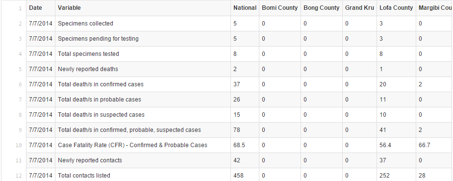

```{r setup, echo = FALSE, message=FALSE, warning=FALSE, cache=FALSE}
knitr::opts_chunk$set(echo = F, 
                      message = F, 
                      warning = F, 
                      cache = F, 
                      tidy = F, 
                      size = "footnotesize", 
                      results = "asis", 
                      comment = "#>", 
                      fig.align = "center", 
                      fig.width = 8, 
                      fig.height = 5)
options(show.signif.stars = F, 
        digits = 4)
set.seed(42)

# miscellaneous packages
library(tidyr)
library(dplyr)
library(lubridate)
library(stringr)
# loading national data
load("data/clean/lib_national_data.RData")
# loading county data
load("data/clean/lib_county_data.RData")
# loading county data
load("data/clean/lib_ebola.RData")
```

## The Data

The raw data [available on GitHub](https://github.com/cmrivers/ebola)



## Thoughts on the Raw Data

* Data are collected at the Country and County levels
* There's a separate file for each date
* There are a lot of potential variables
* Rows and columns are backwards

## Cleaned Data

The cleaned data from the month of July

```{r clean_data_handsontable}
library(rhandsontable)
county_dat %>% 
  select(-lon, -lat, -id, -order) %>% 
  distinct() %>% 
  mutate(Date = ymd(Date)) %>% 
  filter(month(Date) == 7) %>% 
  arrange(Date, Location) %>% 
  rhandsontable(width = 1000, height = 450) 
```

## Examining the Variables over Time

```{r vars_over_time}
library(ggplot2)
theme_set(theme_bw())
# plot of each variable over time
p1 <- national_dat %>% 
  select(-lon, -lat, -Population) %>% 
  gather(Var, Count, -Date) %>% 
  mutate(Var = Var %>% 
           str_replace_all("Case_Fatality_Rate_", "") %>% 
           str_replace_all("Cumulative", "Cum") %>% 
           str_replace_all("probable", "prob") %>% 
           str_replace_all("suspected", "susp") %>% 
           str_replace_all("confirmed", "conf") %>% 
           str_replace_all("Probable", "prob") %>% 
           str_replace_all("Suspected", "susp") %>% 
           str_replace_all("Confirmed", "conf") %>% 
           str_replace_all("_s_", "s_") %>% 
           str_replace_all("Total_", "")
         ) %>% 
  qplot(Date, Count, data = ., geom = "line", facets = ~Var) + 
  theme(axis.text.x = element_text(angle=45), 
        strip.text = element_text(angle = 5))

library(imageR)
library(htmltools)
library(base64enc)

# make a tempfile to hold our chart  
tf <- tempfile()
# delete our tempfile on exit
on.exit(unlink(tf))

# save our chart as a big png; exaggerate the width
png( tf, height = 500, width = 800 )
  p1
d <- dev.off()

intense(
  tags$img(
    style="height:500px;"
    ,src = dataURI(file=tf,mime="image/png")
  )
  ,height = 500
)
```

## Total Cases by County

```{r county_line_plot}
lib_ebola %>% 
  qplot(Date, Total_death_s_in_confirmed_probable_suspected_cases, data = ., 
        group = Location, geom = "line", colour = Location) + 
  scale_colour_discrete(guide = F) + 
  labs(y = "Total Deaths", title = "Spread of Ebola in 2014 by County") 
```

## Map of Liberia

```{r liberia-leaflet}
library(leaflet)
m <- leaflet() %>% 
  addTiles() %>% 
  setView(-9.429499, 6.428055, zoom = 7)
m
```

## Adjusting for Population Size

```{r county_death_rate}
lib_ebola %>% 
  filter(Location != "National") %>% 
  mutate(rate = Total_death_s_in_confirmed_probable_suspected_cases / Population * 1000) %>% 
  qplot(Date, rate, data = ., 
        group = Location, geom = "line", colour = Location) + 
  labs(y = expression(Deaths/1000), title = "Spread of Ebola in 2014 by County") 
```

## Removing 10/28 Data

```{r county_death_rate2}
# setting up cleaned data set for next few plots
dat_plot <- lib_ebola %>% 
  filter(Location != "National") %>% 
  mutate(Rate = Total_death_s_in_confirmed_probable_suspected_cases / Population * 1000 %>% round(3), 
         Date = ymd(Date)) %>% 
  filter(Date != ymd("2014-10-28")) %>% 
  select(Date, Location, Rate)
dat_plot %>% 
  qplot(Date, Rate, data = ., 
        group = Location, geom = "line", colour = Location) + 
  labs(y = expression(Deaths/1000), title = "Spread of Ebola in 2014 by County") 
```

## Streamgraph Visualization

```{r county_death_rate_streamgraph}
library(streamgraph)
dat_plot %>% 
  filter(!is.na(Rate)) %>% 
  streamgraph("Location", "Rate", "Date")
```

## Dimple Visualization

```{r county_death_rate_dimple}
library(rcdimple)
dat_plot %>% 
  filter(!is.na(Rate)) %>% 
  mutate(Date = as.factor(Date)) %>% 
  dimple(Rate ~ Date, groups = "Location", data = ., type = "line") %>% 
  xAxis(
    type = "addTimeAxis",
    inputFormat = "%Y-%m-%d",
    outputFormat = "%b %Y %M",
    timePeriod = htmlwidgets::JS('d3.time.months'),
    timeInterval = 1
  ) %>% 
  add_legend()
```

## Animated Example

```{r county_death_rate_animint}
# over time
# can just adjust the example from county_death_rate2
p_time <- ggplot() + 
  make_tallrect(data = ani_dat, "Date") + 
  geom_line(aes(x = Date, y = Total_suspected_cases, group = Location, colour = Location, 
                showSelected = Location, clickSelects = Location), 
            data = ani_dat) + 
  scale_x_continuous(breaks = c(1.405e9, 1.41e9, 1.415e9), 
                     labels = c("July", "September", "November")) + 
  theme_animint(width = 350) + 
  ggtitle("Ebola Cases in Liberia in 2014") + 
  ylab("Cumulative Suspected Cases")

# map
p_map <- ggplot() + 
  geom_polygon(aes(lon, lat, group = Location), 
               fill = "white", colour = "grey", alpha = I(.3), 
               data = lib_coords) +                                      ## counties
  geom_polygon(aes(lon, lat, group = Location, fill = Total_suspected_cases, alpha = Total_suspected_cases, 
                   showSelected = Date, clickSelects = Location), 
               colour = "grey", data = map_dat) +         ## shaded polygons
  geom_text(aes(lon, lat, label = Location), data = cty_names) +         ## county labels
  scale_fill_gradient2(low = "#f2f0f7", mid = "#cbc9e2", high = "#6a51a3") + 
  scale_alpha_continuous(guide = F) + 
  ggtitle("Ebola Cases in Liberia") + 
  xlab("Longitude") + 
  ylab("Latitude")

# animint
ani_list <- list(timeLine = p_time, 
                 ebolaMap = p_map, 
                 time = list(variable = "Date", ms = 250), 
                 selector.types = list(Location = "multiple"), 
                 first = list(Location = unique(map_dat$Location)))
# works
animint2dir(ani_list, out.dir = "ebola_viz", open.browser = FALSE)
servr::httd("ebola_viz")
```


